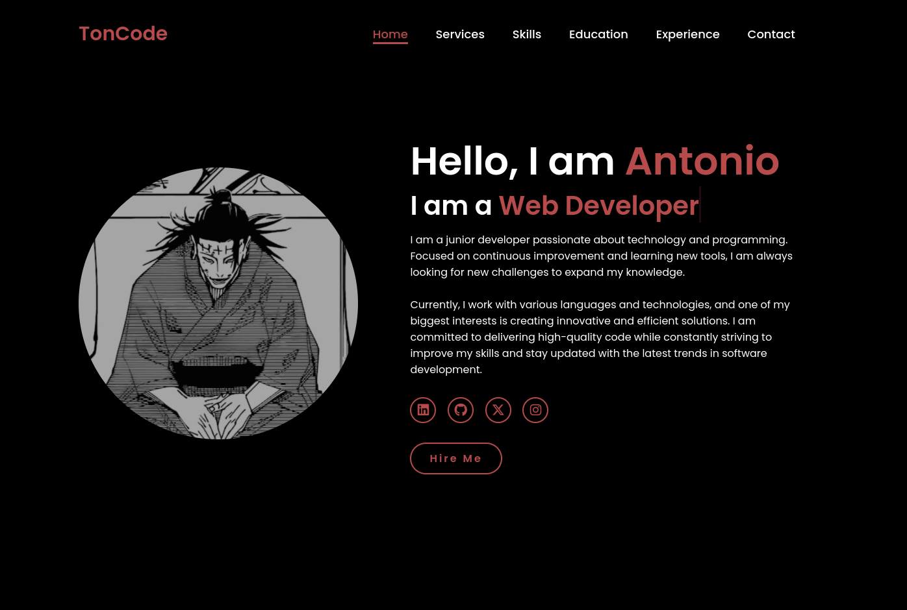

# Simple Home Page - HTML & CSS

This is a simple **Home Page** built using **HTML** and **CSS**. There is no JavaScript or back-end involved. This project is ideal for learning how to structure a basic webpage with HTML and style it with CSS.

## Features

- Basic structure of a home page.
- Simple and responsive design using only HTML and CSS.

## Preview

Here’s how the project looks:


*Home page in desktop view.*

## Prerequisites

You don't need any special tools or software to run this project. Just a web browser and a text editor of your choice.

## How to Run the Project

1. Clone the repository to your machine:

   ```bash
   git clone https://github.com/your-username/simple-home-page.git
   ```

2. Navigate to the project folder:

   ```bash
   cd simple-home-page
   ```

3. Open the **index.html** file in your web browser:

   - Simply double-click the `index.html` file, and it will open in your default web browser.

Alternatively, you can right-click and choose "Open with" to select your preferred browser.

## Project Structure

- **index.html**: The main HTML file for the home page.
- **styles.css**: The stylesheet that styles the home page.

## Technologies Used

- **HTML**: Markup language for the structure of the webpage.
- **CSS**: Stylesheet language used for styling the webpage.

## Customizations

Feel free to modify the **index.html** and **styles.css** files to add more content or adjust the design as per your needs.

## Contributing

If you would like to contribute to this project, feel free to fork the repository and create a pull request with your changes!

---

Thank you for checking out this project!
